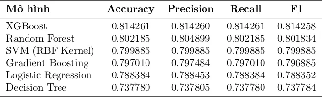
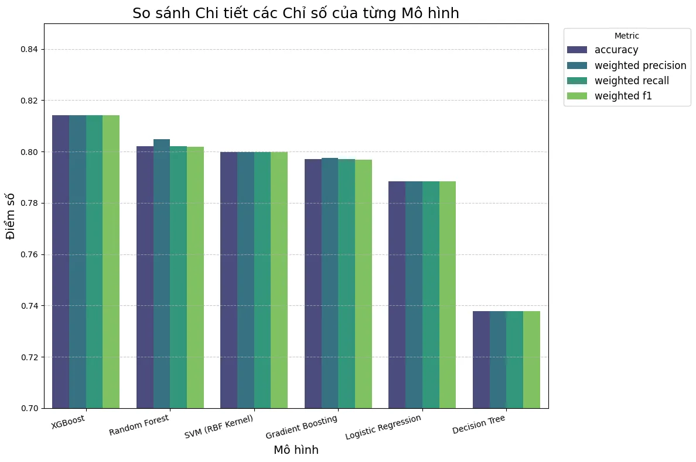

# Spaceship Titanic – Dự đoán Vận Chuyển (Transported Prediction)

**Authors:**  
Lê Chí Đại, Nguyễn Quốc Huy, Phạm Lê Tiến Đạt, Võ Văn Thịnh (Đại học Bách Khoa TP.HCM)

**Course:** ML4U – Bài tập lớn môn Học Máy (2025)

**🌐 Project Landing Page & Report:**  
🔗 https://caotaytang.github.io/ML-251/

**▶️ Run in Google Colab:**  
[](https://colab.research.google.com/drive/1NNmRjgSI6SE14mwKW55yWsWSvvfLDNwm#scrollTo=3ji5yAbSGA28)

---

## 1. Giới thiệu

Dự án giải quyết thử thách **[Spaceship Titanic](https://www.kaggle.com/competitions/spaceship-titanic)** trên Kaggle: dự đoán liệu hành khách có bị **Transported** (dịch chuyển tới chiều khác) sau sự cố trên tàu vũ trụ hay không.  
Chúng tôi tập trung vào:

- Phân tích dữ liệu khám phá (EDA)  
- Feature engineering  
- Xây dựng các pipeline Học máy truyền thống và Học sâu  
- So sánh mô hình và đánh giá hiệu năng  

---

## 2. Dữ liệu & Phân tích Dữ liệu Khám phá (EDA)

- **Cân bằng lớp mục tiêu:** Tỷ lệ giữa các lớp `Transported` là gần như cân bằng.  
- **Giá trị thiếu:** Dataset có missing value trên hầu hết các cột (trừ `Transported` và `PassengerId`).  

---

## 3. Kỹ thuật Tính năng & Pipelines

### Các tính năng mới (Feature Engineering):
- Tách `Cabin` thành `Deck`, `Cabin_num`, `Side`.  
- Phân tách `PassengerId` thành các thành phần hữu ích (`Group`, `Member`).  

### Hai pipeline xử lý:
1. **Classic ML pipeline:**  
   - Điền giá trị thiếu bằng `SimpleImputer`
   - Chuẩn hóa với `StandardScaler`  
   - Mã hóa với `OneHotEncoder`  

2. **XGBoost pipeline:**  
   - Giữ nguyên NaN (XGBoost xử lý missing value hiệu quả)  
   - Chuẩn hóa & mã hóa nhẹ nhàng hơn để tận dụng sức mạnh XGBoost  

---

## 4. Huấn luyện Mô hình & Đánh giá

Các mô hình thử nghiệm:  
- Logistic Regression  
- SVM (RBF)  
- Decision Tree  
- Random Forest  
- Gradient Boosting (XGBoost / LightGBM)  
- XGBoost (tự xử lý missing value)  

Các chỉ số đánh giá:  
- Accuracy, Precision, Recall, F1-score (weighted)  
- Cross-validation (stratified k-fold)  

---

## 5. Kết quả & Phân tích

- **XGBoost** là mô hình hiệu suất tốt nhất và ổn định nhất.  
- **Random Forest**, **SVM** và **Logistic Regression** cũng có hiệu năng gần tương đương.  
- **Decision Tree** đơn lẻ có hiệu năng thấp hơn rõ rệt so với ensemble.  

### 📊 Hiệu năng mô hình (F1-Score, Accuracy, Precision, Recall)

<p align="center">
  
</p>

### 📑 Bảng chi tiết kết quả

<p align="center">
  
</p>


---

## 6. Usage

Clone repo và cài đặt dependency:
```bash
git clone https://github.com/caoTayTang/ML251.git
cd ML251

# (Tuỳ chọn) tạo môi trường ảo
python -m venv venv
source venv/bin/activate   # Linux/Mac
# venv\Scripts\activate      # Windows

pip install -r requirements.txt
```